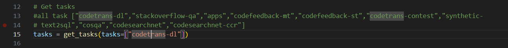

# Просто читал код и случайно понял как добавить свой датасет (распишу по шагам в Резюме)

Picture_1

Picture_2

## COIR подкачивает датасеты с HF Hub, причем работает это без vpn.
Picture_3

## Если в path передать локальный путь, то он распарсит его как датасет. 
Picture_4

Picture_5

## Есть пример от разработчиков как распарсить локальный датасет.
Picture_6

## Резюме
## Чтобы добавить свой датасет надо:
1. подготовить сам датасет (пока хз в каком он формате)
2. в функции `get_task()` *Picture_2* реализовать логику поиска задачи в локальных файлах
3. в по примеру функции `load_data_from_hf` *Picture_3* реализовать функцию `load_local_data` в которой функция `load_dataset` будет принимать локальный путь до датасета *Picture_5-6*. ЛИБО вмонтировать это в саму `load_data_from_hf`, чтобы избежать повторения кода. (НО из офиц примера видно, что надо будет дополнительно передавать параметр формата файла, можно сделать как дефолтный параметр)
## Замечание
По надо посмотреть как хранятся датасеты и можно будет попробовать добавить свой датасет. Ну и т.к не моя задача, пока только расписал, если потребуется, можно довести до ума.

